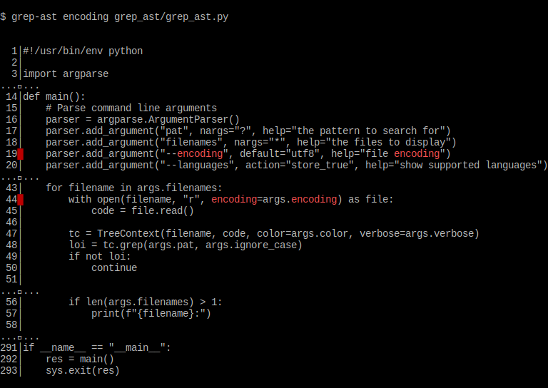
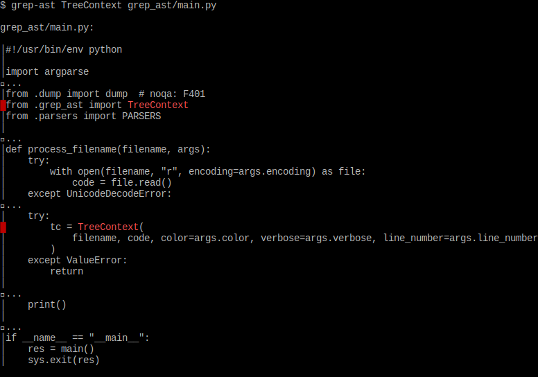

# grep-ast

Grep soure code files and see matching lines with
useful context that show how they fit into the code.
See the loops, functions, methods, classes, etc
that contain all the matching lines.
Get a sense of what's inside a matched class or function definition.
You see relevant code from every layer of the
abstract syntax tree, above and below the matches.

Grep-AST recurses the current directory to find all source code files.
It respects `.gitignore`, so it will usually "do the right thing" in most repos.

Grep-AST is built with [tree-sitter](https://tree-sitter.github.io/tree-sitter/) and
[tree-sitter-languages](https://github.com/grantjenks/py-tree-sitter-languages).
So it supports a lot of popular [code languages](https://github.com/paul-gauthier/grep-ast/blob/main/grep_ast/parsers.py).

## Install

```bash
python -m pip install git+https://github.com/paul-gauthier/grep-ast.git
```

## Usage

Basic usage:

```bash
grep-ast [pattern] [filenames...]
```

Full options list:

```
usage: grep_ast.py [-h] [-i] [--color] [--no-color] [--encoding ENCODING] [--languages] [--verbose]
                   [pat] [filenames ...]

positional arguments:
  pat                  the pattern to search for
  filenames            the files to display

options:
  -h, --help           show this help message and exit
  -i, --ignore-case    ignore case distinctions
  --color              force color printing
  --no-color           disable color printing
  --encoding ENCODING  file encoding
  --languages          print the parsers table
  --verbose            enable verbose output
```

## Examples

Here we search for **"encoding"** in the source to this tool:



Here we search for **"TreeContext"** in the source to this tool:


