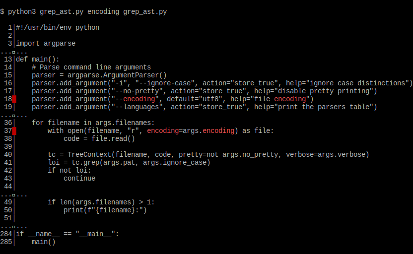
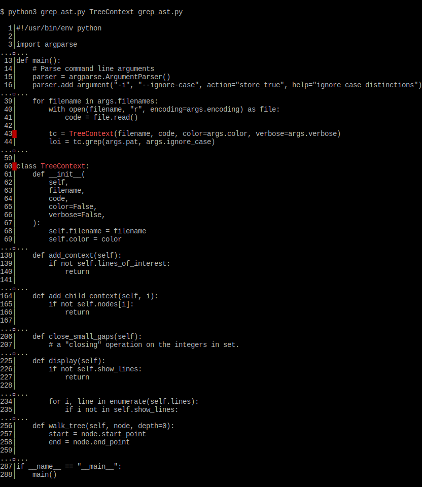

# grep-ast

Grep soure code files and see matching lines with
useful context that show how they fit into the code.
See the loops, functions, methods, classes, etc
that contain all the matching lines.
Get a sense of what's inside a matched class.
You see relevant code from every layer of the
abstract syntax tree, above and below the matches.

Grep-AST is built with [tree-sitter](https://tree-sitter.github.io/tree-sitter/) and
[tree-sitter-languages](https://github.com/grantjenks/py-tree-sitter-languages).
So it supports a lot of popular [code languages](https://github.com/paul-gauthier/grep-ast/blob/main/parsers.py).

## Usage

```bash
python grep_ast.py [pattern] [filenames...]
```

- `pattern`: The pattern to search for.
- `filenames`: The files to search in.
- `-i, --ignore-case`: Ignore case distinctions.
- `--no-pretty`: Do not colorize matches.
- `--languages`: Print out the supported file types.

## Examples

Here we search for **"encoding"** in the source to this tool:

<p align="center">
  
</p>

Here we search for **"TreeContext"** in the source to this tool:

<p align="center">
  
</p>
