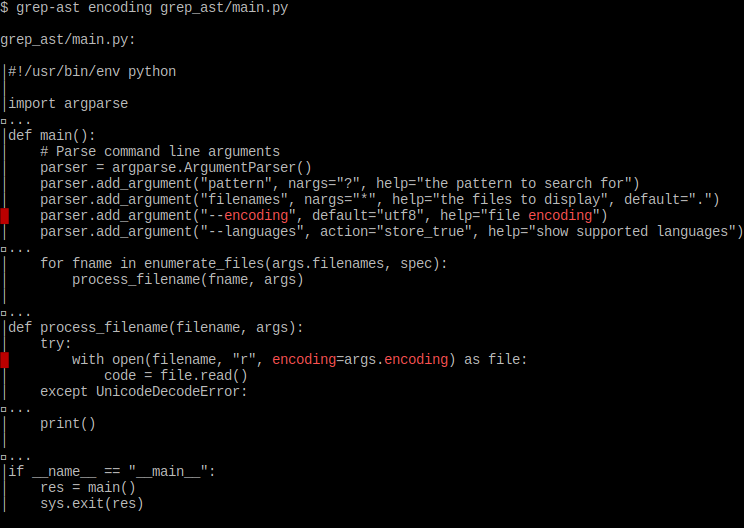
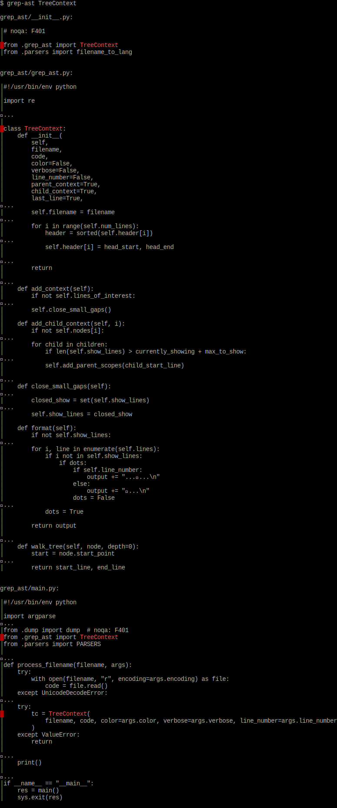

# grep-ast

Grep source code files and see matching lines with
useful context that show how they fit into the code.
See the loops, functions, methods, classes, etc
that contain all the matching lines.
Get a sense of what's inside a matched class or function definition.
You see relevant code from every layer of the
abstract syntax tree, above and below the matches.

By default, grep-AST recurses the current directory to search all source code files.
It respects `.gitignore`, so it will usually "do the right thing" in most repos
if you just do `grep-ast <regex>` without specifying any filenames.

You can also invoke `grep-ast` as `gast` for convenience.

Grep-AST is built with [tree-sitter](https://tree-sitter.github.io/tree-sitter/) and
[tree-sitter-languages](https://github.com/grantjenks/py-tree-sitter-languages).
So it supports a lot of popular [code languages](https://github.com/paul-gauthier/grep-ast/blob/main/grep_ast/parsers.py).

## Install

```bash
python -m pip install git+https://github.com/paul-gauthier/grep-ast.git
```

## Usage

Basic usage:

```bash
grep-ast [pattern] [filenames...]
```

Full options list:

```
usage: grep_ast.py [-h] [-i] [--color] [--no-color] [--encoding ENCODING] [--languages] [--verbose]
                   [pat] [filenames ...]

positional arguments:
  pat                  the pattern to search for
  filenames            the files to display

options:
  -h, --help           show this help message and exit
  -i, --ignore-case    ignore case distinctions
  --color              force color printing
  --no-color           disable color printing
  --encoding ENCODING  file encoding
  --languages          print the parsers table
  --verbose            enable verbose output
```

## Using via Docker Image

### Building the Docker Image

You can build the Docker image for this project by running the following command:

```bash
python setup.py build_docker
```

OR directly from root project directory:

```bash
docker build --file docker/Dockerfile -t grep-ast-image .
```

### Calling grep-ast from Docker image

To grep from current working directory we mount it to docker to give access so paths will work also inside docker, example:

```
docker run -it -v "$(pwd)":/app:ro grep-ast-image str grep_ast/*.py
```

### Using Docker image for pytest tests!

To ensure reproducible testing and ease of debugging, you can run pytest tests inside the Docker image. This is particularly useful when collaborating in an open-source manner.

You can use this docker image e.g. to run pytest:

```bash
python setup.py docker_test
```

OR directly:

```
docker run -it --entrypoint bash grep-ast-image -c 'cd /grep-ast; pwd; pytest'
```

This command will build the Docker image and execute pytest tests inside it.

### If you want to debug Docker image itself

If you want to execute commands inside docker image, overwrite entrypoint with bash and give it commands you want, examples:

```bash
$ docker run -it -v "$(pwd)":/app:ro --entrypoint bash grep-ast-image -c 'cd /app; pwd; ls'
$ docker run -it --entrypoint bash grep-ast-image -c 'cd /grep-ast; pwd; ls'
```

## Examples

Here we search for **"encoding"** in the source to this tool.
These results mainly highlight how `grep-ast`
shows you how the matches fit into the code base.



Here we search for **"TreeContext"** in the source to this tool.
These results mainly highlight how `grep-ast`
helps you understand the *contents* of a matching
named code block (class, function, method, etc).


